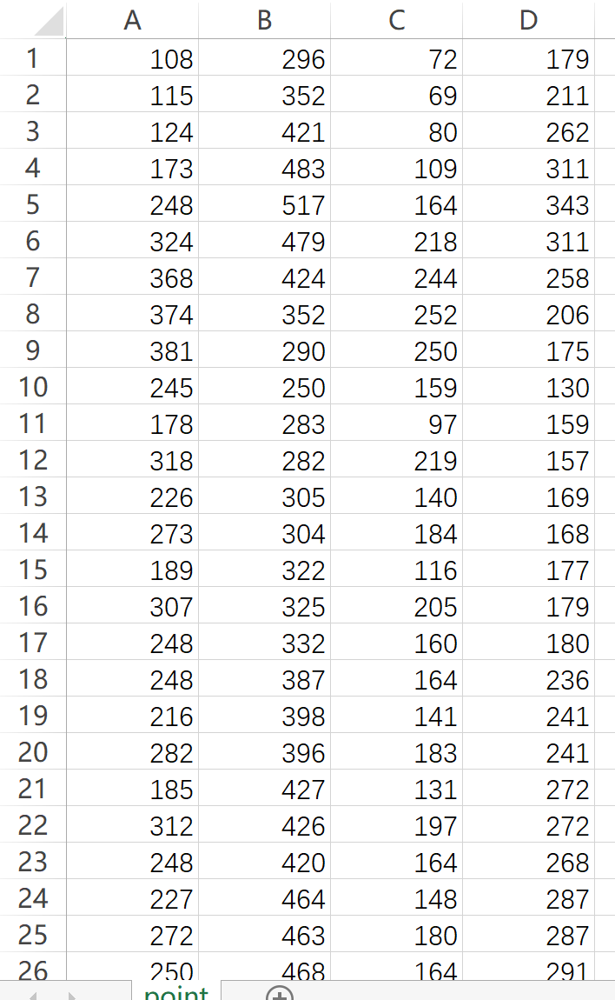

# 计算机视觉附加题2实验报告

## 实验环境

minGW32 g++

**编译命令**：

```powershell
cd Codes
mingw32-make compile
```

## 实验内容

根据**Image Morphing**的方法完成中间**11**帧的差值，得到一个**Image Morphing**的动画视频。

## 实验过程

### 手动描出图像特征点并将对应像素坐标存入文件

- 使用PS描出特征点，结果如下：

  

  

- 获得的坐标点如下：第一列为图1横坐标、第二列为图1纵坐标，第三列为图2横坐标、第四列为图2纵坐标。
- 

### 使用Delaunay算法对图像进行三角形分割

- 这部分算法封装在`Delaunay`类中，分别使用三个Vector存储了图像上的点`Point`、边缘`Edge`和三角形`Triangle`

  1. 初始化：将图像四个边缘点加入Point数组，并将图像以四条边以及任意一条对角线划分为两个三角形，加入Triangle数组。当前形成的五条边也存入Edge数组，其中图像原来的四条边的`count`值为-1（表示超级三角形的边缘），而中间那条对角线由于当前属于两个三角形，因而`count`设置为2.

  2. 对于每一个加入三角形的点，进行如下操作：

     1. 将新点加入`point`数组，并创建影响三角形数组`affectingTriangles`.

        > 这个数组元素类型为int，存放的是影响三角形在`Triangle`数组的下标。

     2. 遍历Triangle数组，判断新点是否在某个数组元素三角形的外接圆内部，若是，则将该三角形的数组下标加入影响三角形数组`affectingTriangles`. 直到Triangle数组遍历完毕。

     3. 删除影响三角形并生成`boundaryEdges`数组：

        > `boundaryEdges`数组用于存放之后新加入的点需要与之构建三角形的边缘。数组元素类型为`Edge`

        1. 删除影响三角形的三条边（函数`deleteCommonEdges`）遍历影响三角形数组：

        ​	对于每条边：

        ​		在`Edge`数组中找到对应边（通过两个端点id相等判断）

        - 如果该边`count`为-1，即为超级三角形的边缘。将该边缘加入数组`boundaryEdges`

        - 如果该边`count`为2，即该边缘当前为两个三角形共享，即使删除当前影响三角形，边缘仍然存在，自然可以与新加入的点构成三角形。将其加入`boundaryEdges`.

        - 如果该边`count`为1，说明该边缘只属于当前影响三角形，删除三角形后边缘将不复存在。因而这个边缘不会加入数组`boundaryEdges`中。同时需要将边缘从Edge数组中删除。

          > 在从`Edge`数组中删除的时候还需要检查`boundaryEdges`是否在之前加入了当前需要删除的点。比如两个有一条边重合的三角形，遍历到第一个影响三角形时会导致·`count`从2到1并加入`boundaryEdges`，但实际上当遍历到第二个三角形的时候是需要将边缘删除的。

          为了提高速度，在`Edge`数组中找到该边缘之后需要break出遍历Edge数组的循环。

        2. 删除影响三角形并更新`affectingTriangles`数组

           - 将该影响三角形根据数组元素（即下标）从`Triangle`三角形中删除。

           - 由于从Triangle数组中移除元素后所有元素的下标会迁移，因此需要将`affectingTriangles`中每个元素-1.

     4. 将插入的点同`boundaryEdges`的每条边连接起来。

        对于`boundaryEdges`中的每个边缘，将该边缘的两个端点和新加入的点作为三个顶点创建新的三角形。

        > 这里传递的是点在Point数组中的下标，可作为每个点的id

        - 插入新生成的边，对于三角形的三条边，在`Edge`数组中找相同边：
          - 若存在为-1，则不做改变
          - 若存在不为-1，则该边缘`count`++
          - 若不存在，则加入`Edge`数组。
        - 将新创建的三角形加入三角形数组

- 这一步骤完成后可以获得下面的结果：

  

  

### 获取中间帧的点坐标

- 这一步我存储了一个Point类型二维数组，每行为一帧内的所有点，每列为每个点的坐标。

- 对于每一帧i，id为j的点，进行如下计算：

  ```cpp
  x = mesh1.pointVector[j].x * (1-(double)i/FRAMESNUMBER) 
      + mesh2.pointVector[j].x * (double)i/FRAMESNUMBER;
  y = mesh1.pointVector[j].y * (1-(double)i/FRAMESNUMBER) 
      + mesh2.pointVector[j].y * (double)i/FRAMESNUMBER;	
  ```

### 对每一帧进行变换

- 首先计算出初始帧和最后帧的每个三角形构成的矩阵：
  $$
  \left[                
  \begin{array}{lcr}     
  A_x & B_x & C_x \\          
  A_y & B_x & C_y 
  \end{array}            
  \right]
  $$
  并存入`start`和`end`的矩阵类型数组。

- 新建图像作为中间帧，遍历中间帧的每个像素：

  - 遍历三角形数组获得其在当前帧所在的三角形，这里使用重心法（`isInTriangle`函数判断点在三角形内）
  - 获得其变换矩阵`trans`满足：

  $$
  \left[                
  \begin{array}{lcr}     
  A_x & B_x & C_x \\          
  A_y & B_x & C_y 
  \end{array}            
  \right] = trans \times\left[                
  \begin{array}{lcr}     
  A_x' & B_x' & C_x' \\          
  A_y' & B_x' & C_y' \\
  1 & 1 & 1
  \end{array}            
  \right]
  $$

  > 计算第一幅图的部分时左边矩阵为第一帧对应三角形的三点坐标，计算第二幅图的部分时右边矩阵为第二帧对应的三角形的三点坐标。右边是当前帧该三角形的三点坐标用1补为方阵形成的矩阵。

  ​	当前坐标在原图（第一帧或者最后一帧）中的位置通过下面公式计算：
  $$
  \left[
  \begin{array}{lcr}P_x \\ P_y \end{array}            \right] = trans \times\left[                \begin{array}{lcr}    x \\ y \\1\end{array}            \right]
  $$
  ​	由于获得的坐标不一定为整数，使用线性插值的方法取周围四个整数点坐标进行加权插值（在`bilinearInterpolate`函数中实现，这里注意数组越界问题）。

  ​	对在第一帧和最后一帧获得的线性插值的像素值结果进行双线性插值之后，调整透明度，获得中间帧图像：

  ```cpp
  temp = (1-i/FRAMESNUMBER) * rgb1 + i/FRAMESNUMBER * rgb2;
  ```

## 实验结果

> 动图为用ps制作的，在Results文件夹中的`makeGIF.gif`文件


## 实验思考

虽然这个实验整体思路比较清晰，也不需要调参，但是期间还是遇到了一些bug。

1. Delaunay对两个图片进行的分割并非一一对应。这个问题是**Bowyer-Watson**的第二个步骤中判断新插入的点是否在某个三角形的外接圆中决定的。当三角剖分经过了一定步骤之后，会发生同样对应眼睛的点一个在图片1中三角形A的外接圆内部，但却在图片2中三角形B而非三角形A'的外接圆内部（假设A和A‘是对应的三角形）。因而只对一个图像进行三角剖分的生成并将结果映射到另一个图像的三角形数组中，即保持两个图像的三角形数组中每个三角形对应的点id是相同的，但是点集不同。

2. 由于特征点较少，在变换的过程中多少能看出三角形边缘处发生错位的情况。我认为这个问题可以使用增加采样点的数目以及引入Beier Neely算法为每个点参考的边缘/点加上权重的方式解决。

3. 不知道是不是windows系统的问题，由于Cimg是多线程库，当库中线程出现段错误的时候（常见的是CImg越界）程序不会报错而会直接停止运行。这时候只能使用gdb调试查看发生段错误的代码位置。